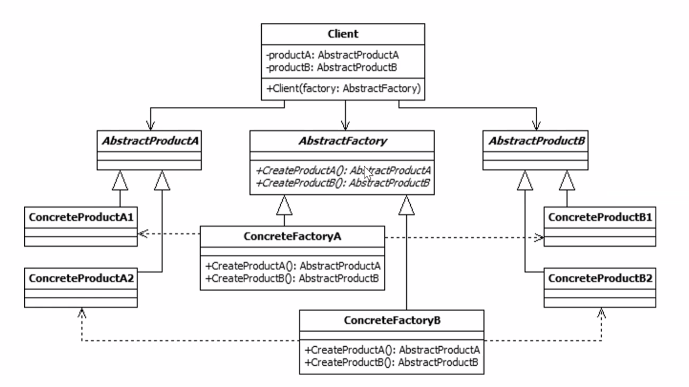

# Design Patterns with Java (LLD)
by Gaurav Kabra


# Creational


### 1. Singleton
Logger, DB Connector 
Disadv:
- Multi threaded env: access must be thread safe
- Dependency inversion regards this as an anti-pattern since use of private and static methods


### 2. Factory
Singleton, in some sense, is also a factory pattern but returns only one type of object.

Also, in factory pattern, clients do not even know the name of class for which object is to be generated. They only know Factory name.

E.g. DB Connector Factory using getConnection method, depending on DB driver. E.g. Oracle driver:
```
Connection conn = DriverManager.getConnection("url", "uname", "pwd");
```
Now different DB vendors have different URL formats.

Different vendors implement the JDBC interfaces.


### 3. Abstract Factory
Factory for factories. E.g. a factory that returns Maruti factory or Skoda factory:





### 4. Prototype
For cloning - shallow or deep.

In Java, unlike Python, we have to implement our own shallow/deep copy methods.


# Structural

### 1. Adapter


